# Module 2 — Computer Fundamentals

## Module Overview

This module introduced the fundamentals of computer systems, different types of computing devices, and client-server architecture. It included hands-on activities and labs designed to reinforce how computers and web applications function.

---

# Section 1 — Inside a Computer System

## Learning Objectives

- Understand the major hardware components of a computer.
- Learn how the boot process works.
- Identify the function of each internal component.

### My Notes

A computer system consists of multiple hardware components that work together.

#### Major Components

- **Motherboard (MB)** – Connects all components together and contains CPU sockets, RAM slots, expansion slots, and various ports.
- **CPU (Central Processing Unit)** – The brain of the computer that executes instructions.
- **RAM (Random Access Memory)** – Fast, temporary memory used while programs are running.
- **GPU (Graphics Processing Unit)** – Processes and outputs visual information to displays.
- **HDD/SSD** – Long-term storage devices used for data retention.
- **PSU (Power Supply Unit)** – Supplies electrical power to all computer components.
- **Network Adapter** – Allows the computer to communicate with other computers and networks.

#### Storage Devices

- **HDD (Hard Disk Drive)** uses older technology with moving parts, which can limit performance.
- **SSD (Solid State Drive)** has no moving parts and uses memory chips, making it significantly faster.
- Storage devices commonly connect through **SATA cables** or **PCIe slots**.

#### Network Adapters

- Can be wired or wireless.
- May be embedded into the motherboard or added as an expansion card.
- Commonly use PCIe expansion slots.

#### Input and Output Devices

Examples include:

- Mouse
- Keyboard
- Printers
- USB devices
- HDMI
- DisplayPort

#### Boot Sequence

1. The power button sends a signal to the PSU.
2. The firmware (UEFI/BIOS) starts.
3. The system performs a **POST (Power-On Self-Test)**.
4. The firmware searches for a bootable device.
5. The bootloader loads the operating system into RAM and transfers control to the operating system.

### Skills Practiced

- Identifying computer hardware components
- Understanding motherboard architecture
- Understanding the computer boot process
- Recognizing storage technologies
- Understanding system startup procedures

### Lab Evidence

#### Task 2 – Motherboard Components Diagram

#### Task 2 – Component Placement Exercise

#### Task 3 – Boot Sequence Practice

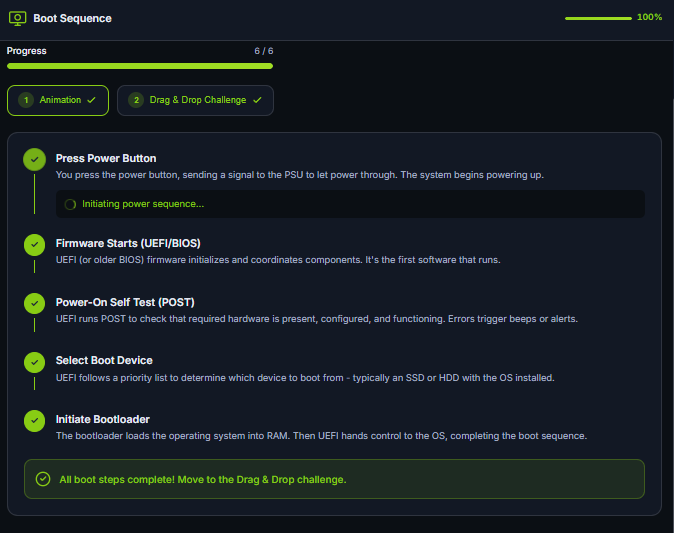

---

# Section 2 — Computer Types

## Learning Objectives

- Identify different types of computing devices.
- Understand how various computer systems are used.
- Practice classifying computing devices.

### My Notes

Computers come in many different forms and are designed for specific tasks and use cases.

#### Common Computer Types

- **Smartphone** – A pocket-sized computer optimized for battery life and connectivity.
- **Tablet** – A touch-based computer with a larger screen.
- **IoT Device** – A network-connected device designed for a specific purpose.
- **Embedded Computer** – A computer built into another device to perform a dedicated function.
- **Laptop** – A portable computer designed for everyday use.
- **Desktop** – A stationary computer that provides sustained performance and better cooling.
- **Workstation** – A high-performance computer designed for professional workloads.
- **Server** – A computer that provides services and resources to multiple users over a network.

#### Key Concepts Learned

- Laptops are portable but have thermal limitations.
- Desktops generally provide better cooling and sustained performance.
- Servers often use redundancy to improve uptime and reduce single points of failure.
- Different computer types exist because each one is optimized for a specific purpose.

### Skills Practiced

- Identifying computer types
- Comparing computing devices
- Understanding hardware trade-offs
- Matching hardware to real-world scenarios

### Lab Evidence

#### Task 2 – Computing Device Types

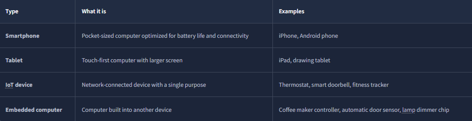

#### Task 3 – Computer Type Comparison

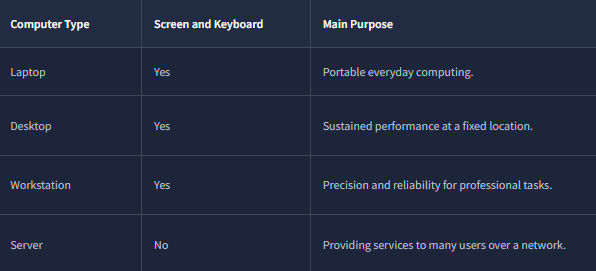

#### Task 4 – Smart Device Identification Lab

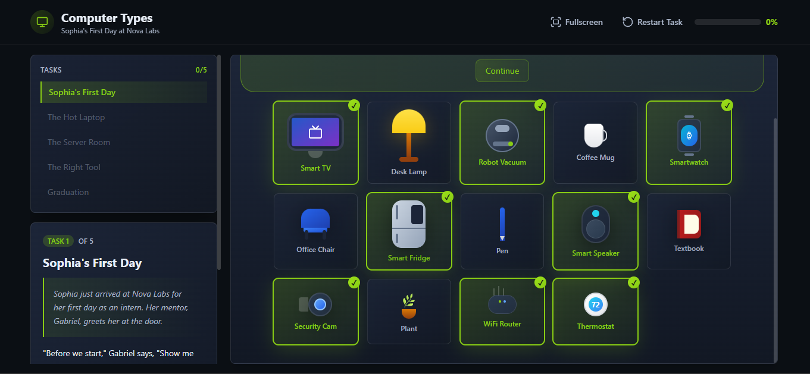

#### Task 4 – Laptop vs Desktop Cooling Lab

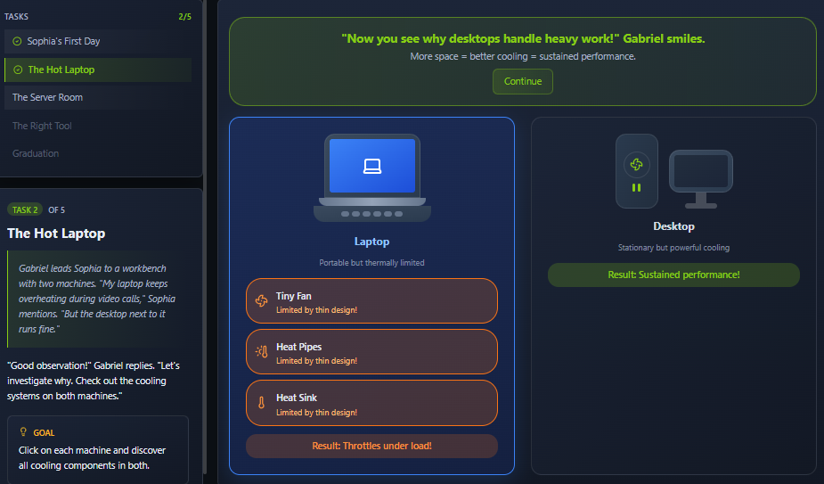

#### Task 4 – Server Redundancy Lab

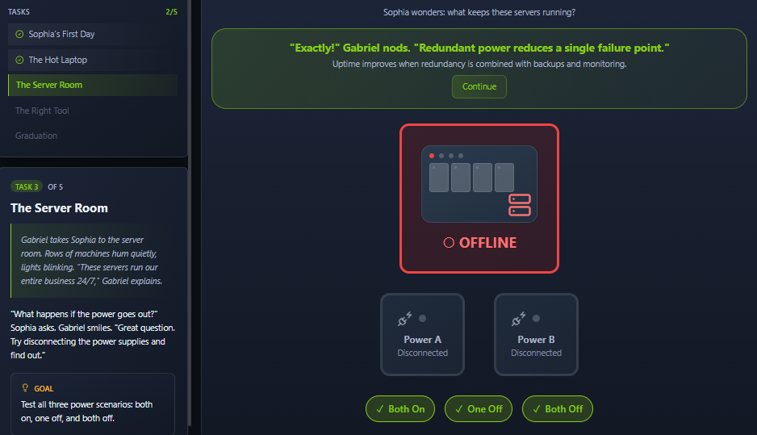

#### Task 4 – Computer Role Matching Lab

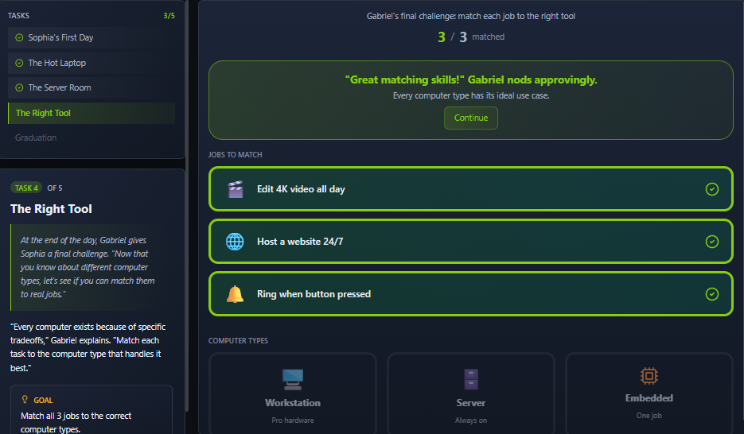

---

# Section 3 — Client-Server Basics

## Learning Objectives

- Understand client-server architecture.
- Learn how web applications communicate.
- Explore HTTP requests and responses.

### My Notes

Client-server architecture is a model where a client requests information or services from a server.

#### Key Concepts

- A **Client** is the device making the request.
- A **Server** provides information or services.
- A **Request** is sent from the client to the server.
- A **Response** is sent back from the server to the client.
- A **Protocol** is a set of rules used for communication.
- A **Port** is a specific access point used by applications and services.
- **DNS (Domain Name System)** translates domain names into IP addresses.

#### HTTP Communication

1. The client sends an HTTP request.
2. The server processes the request.
3. The server sends an HTTP response.
4. The client receives and displays the content.

#### DevTools Lab

Using Firefox Developer Tools, I practiced:

- Viewing HTTP GET requests.
- Reading the Headers tab.
- Reading the Response tab.
- Identifying files requested by a webpage.

### Skills Practiced

- Client-server architecture
- HTTP communication
- Web requests and responses
- Browser Developer Tools
- Network traffic analysis

### Lab Evidence

#### Task 2 – Client-Server Concepts Diagram

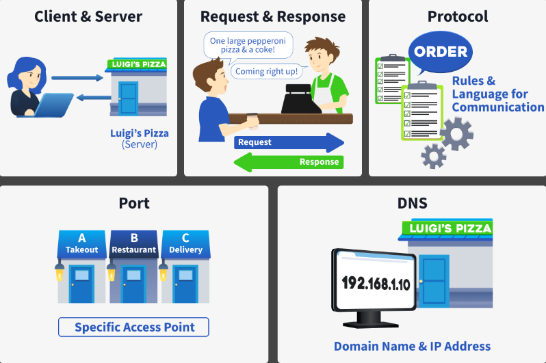

#### Task 3 – HTTP Communication Diagram

#### Task 3 – HTTP GET Request Lab

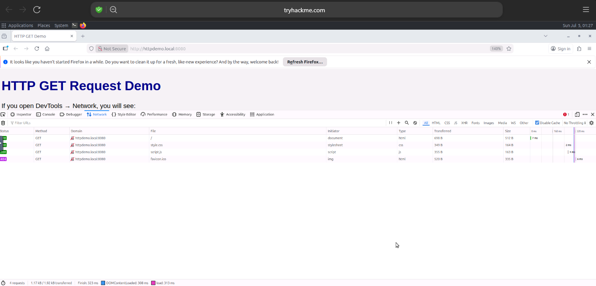

#### Task 3 – HTTP Headers Investigation

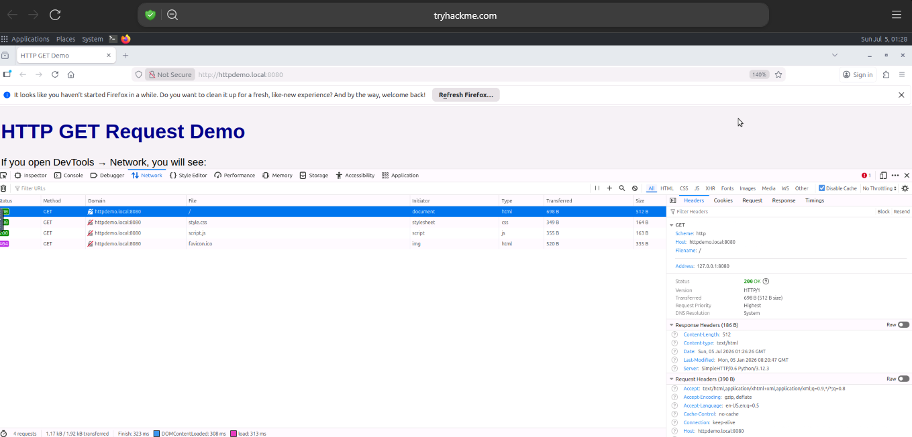

#### Task 3 – HTTP Response Investigation

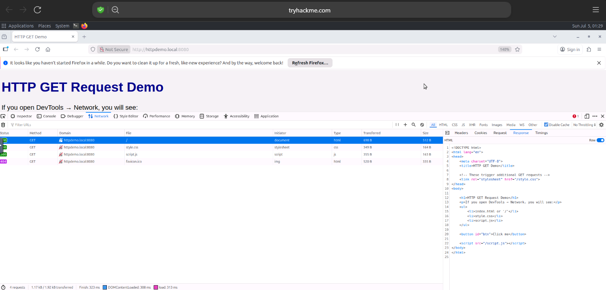

---

# Section 4 — Virtualisation Basics

## Learning Objectives

- Understand what virtualization is.
- Learn how virtual machines work.
- Explore the benefits and uses of virtualization technology.

### My Notes

> Add your notes here.

### Lab Evidence

*Add screenshots here.*

---

# Section 5 — Cloud Computing Fundamentals

## Learning Objectives

- Understand the fundamentals of cloud computing.
- Learn about different cloud service models.
- Understand the benefits and challenges of cloud services.

### My Notes

> Add your notes here.

### Lab Evidence

*Add screenshots here.*