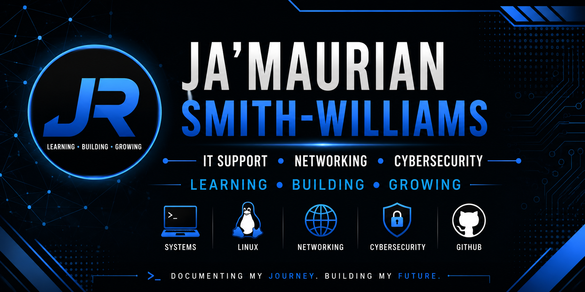

<p align="center">
  
</p>

<h1 align="center">🌱 Root & Repository</h1>

<p align="center">
  <strong>Learning. Building. Documenting. Growing.</strong>
</p>

<p align="center">
A professional portfolio documenting my journey through IT Support, Networking, Cybersecurity, Linux, and Career Development.
</p>

---

# 📖 About

Welcome to **Root & Repository**, my central professional learning portfolio.

This repository documents my journey toward becoming an IT Support professional while building the technical foundation needed for a long-term career in cybersecurity.

Rather than simply completing courses or earning certifications, I document every step of my learning through structured notes, hands-on labs, troubleshooting exercises, technical projects, and professional documentation.

Inside you'll find:

- 💻 IT Fundamentals
- 🌐 Networking Labs
- 🛡️ Cybersecurity Documentation
- 🐧 Linux Learning
- 🔍 Investigations
- ⚙️ Bash, PowerShell & Python
- 📚 Study Notes
- 💼 Career Development

---

# 🎯 Career Objective

My immediate goal is to begin my career in an **entry-level IT Support or Help Desk role** while continuing to strengthen my skills in networking, Windows, Linux, scripting, and cybersecurity through hands-on projects and professional documentation.

My long-term goal is to transition into a cybersecurity role by combining real-world IT experience with continuous learning and practical technical experience.

---

# 🚀 Quick Navigation

- 📖 About
- 🎯 Career Objective
- 📂 Portfolio Dashboard
- 🌱 Learning Philosophy
- 🎯 Current Journey
- 💻 Core Skills
- 🎓 Certifications & Achievements
- 🛠️ Featured Projects
- 🧪 Future Labs
- 📂 Repository Structure
- ⚙️ Documentation Workflow
- 📏 Repository Standards
- 🗺️ Roadmap
- 📬 Contact

---

# 📂 Portfolio Dashboard

| Section | Description |
|----------|-------------|
| 💼 Career | Resume, LinkedIn, interview preparation, job search |
| 🛡️ Cybersecurity Academy | Structured learning, assessments, practical exercises |
| 🌐 Networking | Cisco Networking Academy, Packet Tracer labs, networking notes |
| 🐧 Linux | Linux documentation, Bash scripting, WSL, virtual machines |
| 🔍 Investigations | Windows investigations, Wireshark analysis, troubleshooting |
| 🛠️ Projects | Hands-on IT and cybersecurity projects |
| ⚙️ Scripts | Bash, PowerShell, and Python automation |
| 📚 Resources | Cheat sheets, references, documentation |
| 📝 Templates | Reusable documentation templates |
| 📏 Standards | Repository workflows and documentation standards |
| 🧭 Roadmap | Learning plans and certification roadmap |

---

# 🌱 Learning Philosophy

This repository is built around one simple philosophy:

> **Learn → Practice → Document → Improve**

Every concept is reinforced through structured documentation, hands-on experience, repeatable workflows, and continuous reflection.

I believe documentation is just as important as technical ability because it demonstrates organization, communication, and professional growth.

---

# 🎯 Current Journey

## 📚 Currently Learning

- Cisco Networking Academy – Networking Basics
- Linux Administration
- Windows Fundamentals
- Networking Fundamentals
- Git & GitHub
- Bash
- TryHackMe

### 🛠️ Active Projects

- Root & Repository Portfolio
- Cisco Networking Academy Documentation
- TryHackMe Documentation
- Linux Documentation
- Career Development

### 🎯 Current Priorities

- Strengthen networking knowledge
- Continue expanding my GitHub portfolio
- Apply for entry-level IT Support positions
- Build professional connections within IT and cybersecurity

---

# 💻 Core Skills

## Operating Systems

- Windows 11
- Ubuntu Linux
- Windows Subsystem for Linux (WSL)

## Networking

- TCP/IP
- OSI Model
- DHCP
- DNS
- Routing & Switching Fundamentals
- Cisco Packet Tracer

## Cybersecurity

- Security Fundamentals
- TryHackMe
- Wireshark
- Nmap / Zenmap

## Scripting & Automation

- Bash
- PowerShell
- Python

## Development Tools

- Git
- GitHub
- Visual Studio Code

## Professional Skills

- Technical Documentation
- Troubleshooting
- Research
- Problem Solving
- Version Control

---

# 🎓 Certifications & Achievements

## ✅ Completed

- TryHackMe – Pre Security Learning Path
- TryHackMe – Pre Security Certificate
- Cisco Networking Academy – Getting Started with Cisco Packet Tracer

## 🚧 In Progress

- Cisco Networking Academy – Networking Basics

## 📅 Planned

- CompTIA A+
- CompTIA Network+
- CompTIA Security+
- CompTIA CySA+
- CISSP (Long-Term)

---

# 🏆 Professional Milestones

- Built a structured GitHub learning portfolio
- Developed standardized documentation workflows
- Began networking with IT professionals on LinkedIn
- Continuing hands-on IT and cybersecurity projects

---

# 🛠️ Featured Projects

- 🌱 Root & Repository Portfolio
- 🛡️ TryHackMe Documentation
- 🌐 Cisco Networking Academy Documentation
- 🐧 Linux Documentation & Command Reference
- 📚 Networking Documentation
- 💼 Career Portfolio Development

---

# 🧪 Future Labs

- Ubuntu Linux VM
- Kali Linux VM
- Windows 11 VM
- Windows Server Lab
- Active Directory Lab
- osTicket Help Desk Lab
- pfSense Firewall Lab
- SIEM Lab
- Vulnerability Scanning Lab

---

# 📂 Repository Structure

```text
root-and-repository/

├── Career/
├── Cybersecurity-Academy/
├── Investigations/
├── Linux/
├── Networking/
├── Projects/
├── Resources/
├── Roadmap/
├── Screenshots/
├── Scripts/
├── Standards/
├── Templates/
└── TryHackMe/
```

---

# ⚙️ Documentation Workflow

Every major topic, lab, investigation, or project follows the same structured workflow:

1. Learn the concept
2. Create handwritten notebook notes
3. Complete the hands-on lab or project
4. Capture supporting screenshots
5. Produce professional documentation
6. Organize files within the repository
7. Commit changes using Git and GitHub

This repeatable workflow helps ensure every learning experience is documented consistently while building a professional portfolio.

---

# 📏 Repository Standards

Every contribution follows these principles:

- Accuracy before completion
- Hands-on validation whenever possible
- Clear and consistent documentation
- Supporting screenshots for practical work
- Reflection and lessons learned
- Version-controlled development with Git

---

# 🗺️ Roadmap

## Current Focus

- Cisco Networking Academy
- Windows Fundamentals
- Linux Administration
- Git & GitHub
- Technical Documentation

## Next Goals

- Home Lab Development
- Active Directory
- Help Desk Portfolio
- Networking Projects
- Cloud Fundamentals

## Long-Term Goals

- CompTIA A+
- CompTIA Network+
- CompTIA Security+
- Entry-Level IT Support Position
- Cybersecurity Career

---

# 📈 Repository Status

- ✅ Repository Organized
- ✅ Documentation Standards Established
- ✅ Templates Implemented
- ✅ TryHackMe Pre Security Completed
- ✅ Cisco Packet Tracer Course Completed
- 🚧 Portfolio Continuously Growing

---

# 📬 Contact

**Ja'Maurian Smith-Williams**

🎓 Incoming Traviss Technical College Student

💻 Aspiring IT Support & Cybersecurity Professional

**GitHub**

https://github.com/JaMau1Tech

**LinkedIn**

https://www.linkedin.com/in/ja-maurian-smith-williams-46784741b/

**TryHackMe**

https://tryhackme.com/p/jamaur1tech

---

<p align="center">

<strong>Root & Repository</strong><br>

<em>Learning. Building. Documenting. Growing.</em>

</p>
